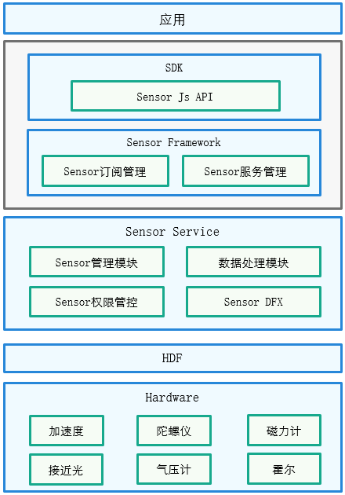

# Sensor组件<a name="ZH-CN_TOPIC_0000001148682248"></a>

-   [简介](#section11660541593)
-   [目录](#section44981327519)
-   [约束](#section98068674513)
-   [使用](#section1581412211528)
    -   [接口说明](#section15684191115524)
    -   [使用说明](#section1543714111810)

-   [相关仓](#section96071132185310)

## 简介<a name="section11660541593"></a>

传感器是指用于侦测环境中所发生事件或变化，并将此消息发送至其他电子设备（如中央处理器）的设备，通常由敏感组件和转换组件组成。传感器是实现物联网智能化的重要基石，为实现全场景智慧化战略，支撑“1+8+N”产品需求，需要构筑统一的传感器管理框架，达到为各产品/业务提供低时延、低功耗的感知数据的目的。根据用途可分为以下六大类：

-   运动类：加速度、陀螺仪、重力、线性加速度传感器等
-   姿态类：旋转矢量、方向传感器等
-   环境类：磁力计、气压、湿度传感器等
-   光线类：环境光、接近光、色温传感器等
-   健康类：心率、心跳传感器等
-   其它：霍尔传感器、手握传感器等

传感器架构图如下所示：

**图 1**  Sensor架构图<a name="fig18632347122018"></a>  




## 目录<a name="section44981327519"></a>

sensor导入模块的示例代码如下：

```
/base/sensors/sensor
├── frameworks                 # 框架代码
│   └── native                 # sensor客户端代码          
├── interfaces                 # 对外接口存放目录
│   ├── native                 # sensor native实现
│   └── plugin                 # Js API
├── sa_profile                 # 服务名称和服务的动态库的配置文件
├── services                   # 服务的代码目录
│   └── sensor                 # 传感器服务，包括加速度、陀螺仪等，上报传感器数据
└── utils                      # 公共代码，包括权限、通信等能力
```

## 约束<a name="section98068674513"></a>

-   要使用传感器的功能，设备必须具有对应的传感器器件。

-   针对某些传感器，开发者需要请求相应的权限，才能获取到相应传感器的数据。

    **表 1**  传感器权限列表

    <a name="table1379101653916"></a>
    <table><thead align="left"><tr id="row137911161397"><th class="cellrowborder" valign="top" width="23.46765323467653%" id="mcps1.2.5.1.1"><p id="p15138132134118"><a name="p15138132134118"></a><a name="p15138132134118"></a>传感器</p>
    </th>
    <th class="cellrowborder" valign="top" width="27.61723827617238%" id="mcps1.2.5.1.2"><p id="p2798169398"><a name="p2798169398"></a><a name="p2798169398"></a>权限名</p>
    </th>
    <th class="cellrowborder" valign="top" width="13.358664133586636%" id="mcps1.2.5.1.3"><p id="p14791716163914"><a name="p14791716163914"></a><a name="p14791716163914"></a>敏感级别</p>
    </th>
    <th class="cellrowborder" valign="top" width="35.55644435556444%" id="mcps1.2.5.1.4"><p id="p379171633919"><a name="p379171633919"></a><a name="p379171633919"></a>权限描述</p>
    </th>
    </tr>
    </thead>
    <tbody><tr id="row12791216173912"><td class="cellrowborder" valign="top" width="23.46765323467653%" headers="mcps1.2.5.1.1 "><p id="p41385264116"><a name="p41385264116"></a><a name="p41385264116"></a>加速度传感器、加速度未校准传感器、线性加速度传感器</p>
    </td>
    <td class="cellrowborder" valign="top" width="27.61723827617238%" headers="mcps1.2.5.1.2 "><p id="p177941653914"><a name="p177941653914"></a><a name="p177941653914"></a>ohos.permission.ACCELEROMETER</p>
    </td>
    <td class="cellrowborder" valign="top" width="13.358664133586636%" headers="mcps1.2.5.1.3 "><p id="p207991683914"><a name="p207991683914"></a><a name="p207991683914"></a>system_grant</p>
    </td>
    <td class="cellrowborder" valign="top" width="35.55644435556444%" headers="mcps1.2.5.1.4 "><p id="p118061614399"><a name="p118061614399"></a><a name="p118061614399"></a>允许订阅加速度传感器的数据。</p>
    </td>
    </tr>
    <tr id="row480116123911"><td class="cellrowborder" valign="top" width="23.46765323467653%" headers="mcps1.2.5.1.1 "><p id="p1213992174111"><a name="p1213992174111"></a><a name="p1213992174111"></a>陀螺仪传感器、陀螺仪未校准传感器</p>
    </td>
    <td class="cellrowborder" valign="top" width="27.61723827617238%" headers="mcps1.2.5.1.2 "><p id="p13807165395"><a name="p13807165395"></a><a name="p13807165395"></a>ohos.permission.GYROSCOPE</p>
    </td>
    <td class="cellrowborder" valign="top" width="13.358664133586636%" headers="mcps1.2.5.1.3 "><p id="p188031617391"><a name="p188031617391"></a><a name="p188031617391"></a>system_grant</p>
    </td>
    <td class="cellrowborder" valign="top" width="35.55644435556444%" headers="mcps1.2.5.1.4 "><p id="p4804168392"><a name="p4804168392"></a><a name="p4804168392"></a>允许订阅陀螺仪传感器的数据。</p>
    </td>
    </tr>
    <tr id="row68051693916"><td class="cellrowborder" valign="top" width="23.46765323467653%" headers="mcps1.2.5.1.1 "><p id="p191397210413"><a name="p191397210413"></a><a name="p191397210413"></a>计步器</p>
    </td>
    <td class="cellrowborder" valign="top" width="27.61723827617238%" headers="mcps1.2.5.1.2 "><p id="p9802016183911"><a name="p9802016183911"></a><a name="p9802016183911"></a>ohos.permission.ACTIVITY_MOTION</p>
    </td>
    <td class="cellrowborder" valign="top" width="13.358664133586636%" headers="mcps1.2.5.1.3 "><p id="p11801216143916"><a name="p11801216143916"></a><a name="p11801216143916"></a>user_grant</p>
    </td>
    <td class="cellrowborder" valign="top" width="35.55644435556444%" headers="mcps1.2.5.1.4 "><p id="p48010163399"><a name="p48010163399"></a><a name="p48010163399"></a>允许订阅运动状态。</p>
    </td>
    </tr>
    <tr id="row20323104234015"><td class="cellrowborder" valign="top" width="23.46765323467653%" headers="mcps1.2.5.1.1 "><p id="p3139172144118"><a name="p3139172144118"></a><a name="p3139172144118"></a>心率传感器</p>
    </td>
    <td class="cellrowborder" valign="top" width="27.61723827617238%" headers="mcps1.2.5.1.2 "><p id="p7323942174013"><a name="p7323942174013"></a><a name="p7323942174013"></a>ohos.permission.READ_HEALTH_DATA</p>
    </td>
    <td class="cellrowborder" valign="top" width="13.358664133586636%" headers="mcps1.2.5.1.3 "><p id="p1232314214407"><a name="p1232314214407"></a><a name="p1232314214407"></a>user_grant</p>
    </td>
    <td class="cellrowborder" valign="top" width="35.55644435556444%" headers="mcps1.2.5.1.4 "><p id="p12323144254018"><a name="p12323144254018"></a><a name="p12323144254018"></a>允许读取健康数据。</p>
    </td>
    </tr>
    </tbody>
    </table>


## 使用<a name="section1581412211528"></a>

本节以传感器 JS API为例，说明其提供的具体功能以及使用流程。

### 接口说明<a name="section15684191115524"></a>

传感器 JS API：监听传感器数据变化，如果多次调用该接口，则最后一次调用生效。JS API开放的能力如下：

**表 2**  JS API的主要接口

<a name="table13821942165419"></a>
<table><thead align="left"><tr id="row6821194225417"><th class="cellrowborder" valign="top" width="40.11%" id="mcps1.2.3.1.1"><p id="p3822542145420"><a name="p3822542145420"></a><a name="p3822542145420"></a>接口名</p>
</th>
<th class="cellrowborder" valign="top" width="59.89%" id="mcps1.2.3.1.2"><p id="p0822942175411"><a name="p0822942175411"></a><a name="p0822942175411"></a>描述</p>
</th>
</tr>
</thead>
<tbody><tr id="row1782284211544"><td class="cellrowborder" valign="top" width="40.11%" headers="mcps1.2.3.1.1 "><p id="p18666622171316"><a name="p18666622171316"></a><a name="p18666622171316"></a>on(type: SensorType, callback: Callback&lt;Response&gt;, options?: Options)</p>
</td>
<td class="cellrowborder" valign="top" width="59.89%" headers="mcps1.2.3.1.2 "><p id="p1476355071517"><a name="p1476355071517"></a><a name="p1476355071517"></a>监听传感器数据变化。SensorType为支持订阅的传感器类型，callback表示订阅传感器的回调函数，options为设置传感器数据上报的时间间隔。</p>
</td>
</tr>
<tr id="row1489993155613"><td class="cellrowborder" valign="top" width="40.11%" headers="mcps1.2.3.1.1 "><p id="p1490010315564"><a name="p1490010315564"></a><a name="p1490010315564"></a>once(type: SensorType, callback: Callback&lt;Response&gt;)</p>
</td>
<td class="cellrowborder" valign="top" width="59.89%" headers="mcps1.2.3.1.2 "><p id="p5900163115564"><a name="p5900163115564"></a><a name="p5900163115564"></a>监听传感器数据变化一次。SensorType为支持订阅的传感器类型，callback表示订阅传感器的回调函数。</p>
</td>
</tr>
<tr id="row1909165317562"><td class="cellrowborder" valign="top" width="40.11%" headers="mcps1.2.3.1.1 "><p id="p16909135319564"><a name="p16909135319564"></a><a name="p16909135319564"></a>off(type: SensorType, callback: Callback&lt;void&gt;)</p>
</td>
<td class="cellrowborder" valign="top" width="59.89%" headers="mcps1.2.3.1.2 "><p id="p3909165315613"><a name="p3909165315613"></a><a name="p3909165315613"></a>取消订阅传感器数据。SensorType为支持的取消订阅的传感器类型，callback表示取消订阅传感器是否成功。</p>
</td>
</tr>
</tbody>
</table>


### 使用说明<a name="section1543714111810"></a>

1.  导包。
2.  注册并监听加速度传感器数据的变化。
3.  取消订阅加速度传感器数据的变化。
4.  注册并监听加速度传感器数据的变化一次。

示例代码：

```
//步骤1 导包
import sensor from '@ohos.sensor';
export default {
    onCreate() {
        //步骤2 监听传感器数据变化，并注册传感器类型
        sensor.on(sensor.SENSOR_TYPE_ID_ACCELEROMETER, (error, data) => {
            if (error) {
                console.error("Failed to subscribe to acceleration data. Error code: " + error.code + "; message: " + error.message);
                return;
            }
            console.info("Acceleration data obtained. x: " + data.x + "; y: " + data.y + "; z: " + data.z);
        }, {'interval':200000000});
        //步骤3 设置10秒后取消订阅传感器数据
        setTimeout(function(){
            sensor.off(sensor.SENSOR_TYPE_ID_ACCELEROMETER, function(error) {
                if (error) {
                    console.error("Failed to unsubscribe from acceleration data. Error code: " + error.code + "; message: " + error.message);
                    return;
                }
                console.info("Succeeded in unsubscribe from sensor data");
            });
        } ,10000);
        //步骤4 监听传感器数据变化一次，并注册传感器类型
        sensor.once(sensor.SENSOR_TYPE_ID_ACCELEROMETER, (error, data) => {
            if (error) {
                console.error("Failed to subscribe to gravity data. Error code: " + error.code + "; message: " + error.message);
                return;
            }
            console.info("Acceleration data obtained. x: " + data.x + "; y: " + data.y + "; z: " + data.z);
       });
    }
    onDestroy() {
        console.info('AceApplication onDestroy');
    }
}
```

## 相关仓<a name="section96071132185310"></a>

泛Sensor服务子系统

**sensors\_sensor**

[sensors\_miscdevice](https://gitee.com/openharmony/sensors_miscdevice)

